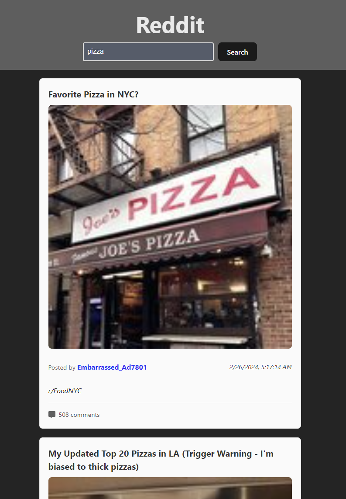
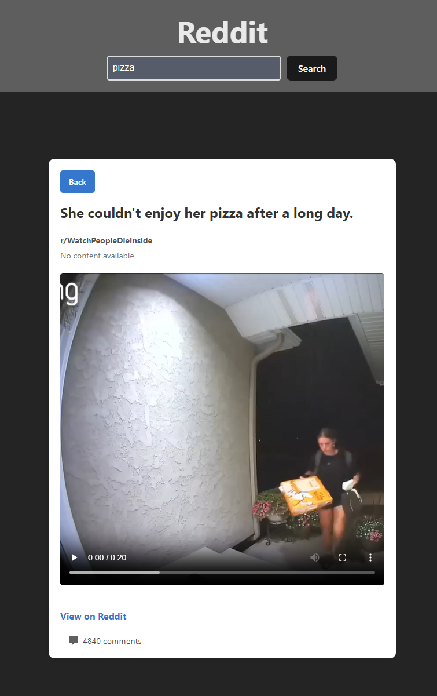
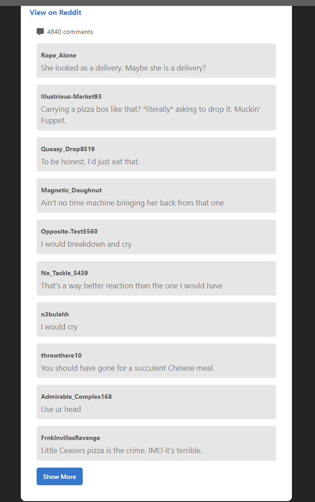

# Reddit Post Viewer

This is a Reddit Post Viewer project built with JavaScript and React. The application fetches and displays posts from Reddit along with related data such as comments and author details. It's designed to provide a clean and interactive way to explore Reddit content directly from the app interface.

## Technologies Used

- **React**: For building the user interface.
- **JavaScript (ES6+)**: Core programming language for the app.
- **Reddit API**: To fetch posts and related data from Reddit.
- **CSS**: For styling and making the UI responsive.

## Features

- **Fetch Reddit Posts**: Retrieve posts from any specified subreddit or general Reddit feed.
- **Post Details**: Display additional details about each post, including the number of comments, author, subreddit and post time.
- **Comment Section**: Load and view comments related to each post.
- **Dynamic Loading**: Supports infinite scrolling or pagination to load more posts seamlessly.
- **Responsive UI**: The app is responsive and works well on different screen sizes.

## Demo

Here are some screenshots of the app:

